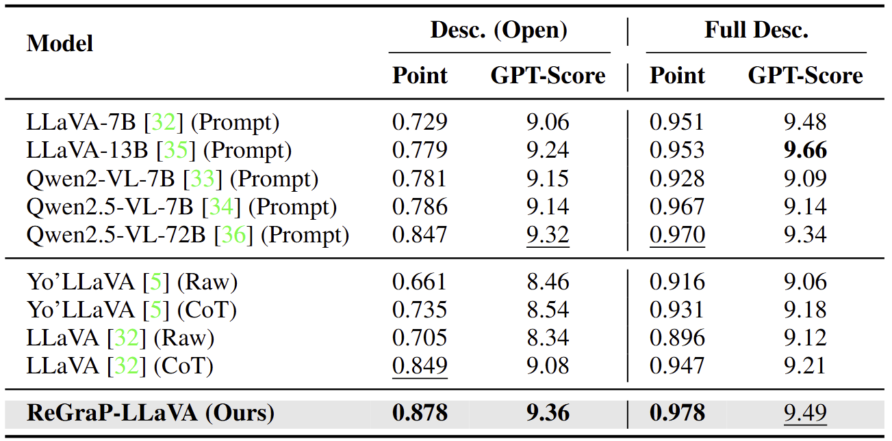

# ReGraP‑LLaVA 🔍 — Reasoning‑enabled Graph‑based Personalized Large Language and Vision Assistant

> **TL;DR**  
> We propose ReGraP-LLaVA, a personalized MLLM trained on the knowledge graphs and CoT data, not only learns personalized knowledge, but also perform relational reasoning among them.

<div align="center">
  
  <br> General MLLMs struggle to handle personalized quires and previous personalized MLLMs focus on recognition and captioning, while ReGraP-LLaVA learns relations among personalized knowledge and provides accurate and contextual responses.
</div>

---

## Motivation 🤔

* **Scenario Limitation.** Previous methods only consider object(s) recognition, while real-world queries often involve attributes and relations of multiple objects.
* **Human‑style connections.** People reason over *relations*, while most personalized MLLMs don’t.  
* **KGs + CoT ⇒ Reasoning.** Relational knowledge and step‑by-step rationales unlocks queries like “*Who can help Bocchi in lyric writing?*”.

---


## Method ⚙️

> **TL;DR**  
> We utilize KGs and CoT reasoning data (CoT QA pairs) to encode personalized knowledge, and train a personalized MLLM to learn the personalized concepts, heir attributes, and relations among them. The model is trained on LLaVA.
---

## ReGraP Dataset 📦 
<div align="center">
  
</div>

| Single‑object | Multi‑object | Avg. objs/set | \# Images/set | Text desc | CoT QA | KG | Len |
|:---------:|:-----------:|:---------:|:------:|:--:|:--:|:--:|:--:|
| ✔︎ | ✔︎ | 5.5 | 20 | ✔︎ | ✔︎ | ✔︎ | ~5.2 |

---


## Results 🏆

### 5.1 Closed‑ended QA

<div align="center">
  
</div>

### 5.2 Open‑ended QA

<div align="center">
  
</div>

### 5.3 Case Study

<div align="center">
  
</div>

<div align="center">
  
</div>

---

## 6. Quick Start 🚀

🚧 Note: This code is under construction 🚧

train and test the model with the following command:

```python
python train.py --set_name $name \
            --exp_name graph --prefix_token $num_of_relations --epoch 10 \
            --model_path $model_path \
            --data_root $image_folder \
            --user_prompt
```
```python
python test.py --set_name $name \
            --exp_name graph --prefix_token $num_of_relations \
            --model_path $model_path \
            --data_root $image_folder \
            --user_prompt
```

